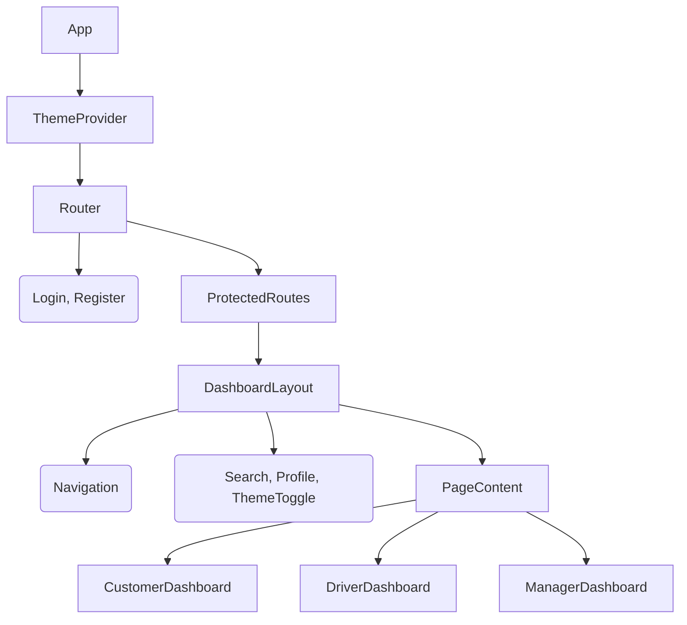

# Frontend Redesign Plan: NeuroFleetX Premium UI

## 1. Executive Summary
We will overhaul the NeuroFleetX frontend to deliver a **premium, "Classic Modern" aesthetic**. The new design will prioritize:
- **Visual Hierarchy**: Clear distinction between content and controls.
- **Classic Elegance**: Timeless iconography and typography paired with modern spacing.
- **Theming**: robust **Dark/Light mode** support based on proper color theory (HSL).
- **Consistency**: A unified Design System for Customer, Driver, and Manager dashboards.

---

## 2. High-Level Design (HLD)

### 2.1 Design Philosophy: "Digital Cockpit"
The design will feel like a high-end vehicle dashboard—clean, informative, and responsive.
- **Light Mode**: Airy, professional, using `Slate-50` backgrounds and `Indigo-600` accents.
- **Dark Mode**: deeply immersive, using `Slate-900` (not pure black) and `Sky-400` accents for readability.
- **Glassmorphism**: Subtle glass effects on overlays (modals, floating panels) to add depth without clutter.

### 2.2 Architecture
We will introduce a **Layout-First** architecture to ensure consistency.



### 2.3 Color Theory (HSL System)
We will use HSL (Hue, Saturation, Lightness) for programmable color relationships.

| Role | Light Mode Value | Dark Mode Value | Meaning |
|------|------------------|-----------------|---------|
| **Surface** | `#F8FAFC` (Slate-50) | `#0F172A` (Slate-900) | Main background |
| **Panel** | `#FFFFFF` (White) | `#1E293B` (Slate-800) | Cards, Sidebar |
| **Primary** | `#4F46E5` (Indigo-600) | `#818CF8` (Indigo-400) | Main actions, active states |
| **Text Primary** | `#1E293B` (Slate-800) | `#F1F5F9` (Slate-100) | Headings, main text |
| **Text Secondary**| `#64748B` (Slate-500) | `#94A3B8` (Slate-400) | Labels, subtitles |
| **Success** | `#10B981` (Emerald-500)| `#34D399` (Emerald-400)| Online, Completed |
| **Warning** | `#F59E0B` (Amber-500) | `#FBBF24` (Amber-400) | Waiting, Maintenance |

---

## 3. Low-Level Design (LLD)

### 3.1 Directory Structure
We will organize `src` to support the design system.
```text
src/
├── components/
│   ├── Common/          # Reusable Atoms
│   │   ├── Button.js    # Variants: primary, ghost, outline
│   │   ├── Card.js      # Glass effect support
│   │   ├── Input.js     # Floating labels
│   │   └── Badge.js     # Status indicators
│   ├── Layout/
│   │   ├── Sidebar.js
│   │   ├── Topbar.js
│   │   └── MainLayout.js
│   └── Dashboard/       # Dashboard specific widgets
├── context/
│   └── ThemeContext.js  # Manages 'light' | 'dark' state
└── styles/
    ├── variables.css    # CSS Variables for colors/spacing
    └── global.css       # Resets & Typography
```

### 3.2 Key Components

#### 1. `ThemeContext` & `variables.css`
Instead of hardcoding colors, we map semantic names to CSS variables that change based on a `[data-theme='dark']` attribute on the `<body>` tag.

**CSS Variable Strategy:**
```css
:root {
  --bg-primary: 248, 250, 252; /* Light bg */
  --text-primary: 15, 23, 42;
}
[data-theme='dark'] {
  --bg-primary: 15, 23, 42;    /* Dark bg */
  --text-primary: 241, 245, 249;
}
```

#### 2. `Sidebar` (Classic Style)
- **State**: Expanded/Collapsed.
- **Style**: Dark in both modes (Classic Dashboard feel) or Adaptive (Light in Light mode). *Decision: Adaptive for cleaner look.*
- **Icons**: Use a standard set (e.g., FontAwesome or Phosphor). classic outlined icons.

#### 3. `CustomerDashboard` Refactor
- **Map Layer**: Remains the centerpiece.
- **Floating Panels**: Replace full-width blocks with floating "cards" over the map (like Uber/Lyft web).
- **Booking Flow**: Stepper interface (Location -> Vehicle -> Confirm) inside a consistent modal/drawer.

### 3.3 Implementation Steps
1.  **Foundation**: Create `ThemeContext` and `variables.css`. Update `index.css`.
2.  **Layout**: Build `MainLayout`, `Sidebar`, `Topbar`.
3.  **Atoms**: Create `Card`, `Button`, `Input` components.
4.  **Migration**:
    - Wrap `App.js` in `ThemeProvider`.
    - Apply `MainLayout` to `CustomerDashboard`.
    - Refactor `CustomerDashboard.js` to use new atoms.
    - (Later) Apply to Driver/Manager dashboards.

---

## 4. Visual Assets

- **Font**: 'Inter' (Modern, legible) or 'Cinzel' (if "Classic" implies serif, but for Dashboards, Sans-Serif is standard. We will stick to **Inter** for UI and maybe **Playfair Display** for Headers if a strictly "Classic" look is desired. *Assumption: User means "Classic UI patterns" not "Classical/Roman" style. We will use Inter.*)
- **Icons**: Material Symbols Outlined (Google) or Phosphor Icons.
- **Shadows**:
    - Light: Diffuse, large spread (`box-shadow: 0 4px 6px -1px rgba(0, 0, 0, 0.1)`).
    - Dark: Glows/Highlights (`box-shadow: 0 0 0 1px rgba(255,255,255,0.1)`).

